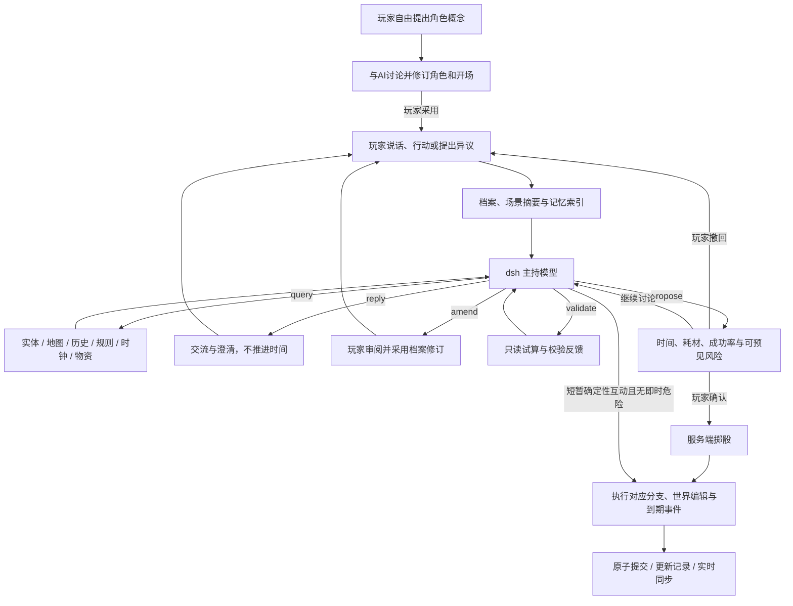

# 主持模型与系统的职责边界

原作的核心是有裁定能力的主持人和一个持续存在的冒险世界。新版把代码当作记账与执行基础，把模型当作有受限世界编辑权的主持人。它需要判断情境、推动NPC、设计新对象、检索旧约定，而不仅是解释一句话对应哪个按钮。

入口先让玩家与主持人开团。玩家给出想扮演的人，AI讨论身份、背景、装备、能力、关系、目标与玩法偏好，整理可反复修改的档案，并把这个人的开场写入原作世界。页面展示对话与草案，采用后才生成可行动角色；没有职业必选项、通用装备包、强制负债或统一从合同桌开始的流程。

## 三种约束，不能混用

**柔性判断**由主持语言、角色档案、世界资料和先例组成。装备来源是否可信、一个新异能用法是否成立、NPC愿不愿意合作、失败意味着什么，都需要结合语境判断。代码不能用职业名、物品名或动作动词白名单代替这些判断。

**辅助检查**指出问题但不替玩家选处境。缺少结晶、能力暂时超出能量上限、带得太重，会反馈给主持人并展示在草案里。可以补齐条件，也可以明确把寻找导体、运输物资等作为开局内容。拥有暂不可用的能力不是非法角色。

**硬性校核**保护已共同确定的事实：弹仓不能超容量，既有库存不能重复领取，不能花不存在的钱，必须有有效引用，不能代替另一玩家确认，随机数不能由叙述伪造。实际施术时还会核对区域、导体和已声明的耗能。它维护游戏承诺的一致性，不负责评判角色概念是否够像某个职业。

## 权责分配

| 内容 | 主要负责人 | 实际边界 |
| --- | --- | --- |
| 身份、行动权、版本、请求回执、原子存档 | 代码 | 模型没有这些字段的写权限；不能替其他玩家确认行动 |
| 自由角色构筑、初始装备、强度与开场 | 玩家 + AI协商 | AI写完整草案；玩家反复修订后采用，不使用固定职业与资产套餐 |
| 专业技能、异能原理与应用范围 | AI写结构 + 语义 | 专长保存关联属性、训练与适用范围；异能保存效果、用途、限制、能耗与负荷 |
| 目标、玩法偏好、玩家自述 | AI按玩家表达直接维护 | reply.record只写当前玩家的柔性字段，不改变资源、伤势或他人角色 |
| 能力成长、背景修正、专长补充 | AI提出amend，玩家采用 | 允许修改属性、专长、能力、经历；不能用修订补血、发钱或撤销已发生结果 |
| 随机数、弹药、现有物资转移、花费、出血、死亡 | 代码 | 所有变化走结算接口，不从叙述猜测数值，不接受任意角色JSON替换 |
| 行为可行性、技能选择、难度、耗时、预见风险 | 模型 + 语言规则 | 由具体办法、工具与现场判断；代码只限制协议范围和明显不成立的账目 |
| 原设定、人物动机、社会关系、信息是否可信 | 模型 + 资料 | 通过原设定摘要、实体秘密、记录检索和规则先例约束，不写成穷尽对话树 |
| 新NPC、藏物点、设备、小地点、初始世界资源 | 模型 | 可直接提出结构化世界编辑；必须说明来源与因果，不能覆盖已有玩家资产 |
| NPC后续行动、设施变化、约定和威胁 | 模型写数据，代码执行时钟 | 模型定义时间、守卫条件、结果；到期且条件仍成立才生效；可以撤销 |
| 裂隙/黑潮的战役级变化 | 模型判断条件，代码执行环境状态 | “关闭”“遏制”会实际改变雾区和异能可用性，不能只在叙述里宣布 |
| 临时装置、新工艺、特殊交互的先例 | 模型 | 写带scope/trigger的案例；以后可检索，不把每个案例变成全局硬规则 |
| 临时状态与异能变体 | AI判断，代码执行已声明的数值 | condition写状态、适用检定与期限；powerTerms协商本次用法的能耗/负荷及理由，不需为每招写函数 |
| 暗线与玩家已知信息 | 双方 | 模型决定何时揭示；服务端投影负责不把秘密、未来时钟、条件分支泄露给客户端 |

语言规则与硬校验的取舍有意不同。代码可以判定弹仓没有子弹，不能可靠判定一个工人的说辞是否打动老高。代码可核对钢丝和零件已经扣除，警报设计能否工作则交给主持人；估价、加工设备、材料性质仍需要模型判断。世界首次生成资源属于主持人的造景权限，已进入账本的资源则必须按接口流转。

这意味着世界内容的合理性依赖模型，不能声称靠JSON校验就消除了幻觉或投机。程序保证“谁改了哪些结构化字段、是否具备权限、物资有没有真的消耗”；语言规则保证故事、因果和裁定尺度。两者不能互相冒充。

## 主持流程与通用接口

`server/ai/adjudicator.ts` 负责模型工具循环，目前最多六轮。资料足够时一次返回即可；模型可以主动查询缺失资料，也能把候选方案交给 `validate`，根据库存、引用或权限错误修正后再提交。查询和试算没有副作用，也不会提前掷骰。

这是应用层的游戏工具协议，经 dsh headless 调用模型。没有将真实文件工具、shell或服务器写权限交给模型，也没有声称实现了 dsh 原生工具插件。这样的适配层可以在以后换传输方式时继续使用同一套游戏能力。

### 查询与汇总

每轮默认提供完整角色的背景、目标、关系、偏好、边界、自创能力与专长，以及当前现场、相邻路线、同地同伴伤情、最近五条记录、少量新事实和先例、全部地理名称索引。未采用的角色修订和待确认行动也进入上下文，因此玩家可以追问或更改正在讨论的方案。长期资料通过 `query(scope, query, limit)` 检索：

- `entity`：完整NPC、对象、玩家角色；GM可见秘密与内部库存。
- `map`：地点与路线。
- `journal`：已结算历史。
- `clocks`：待发生、已取消、已发生事件。
- `rules`：原设定、异能限制、裁定先例。
- `catalog`：物资模板，供估价与生成参照。
- `facts`：公开事实与GM秘密记录。

当前采用结构化摘要加关键词检索，避免每次塞入完整存档。还没有向量检索或后台摘要代理；长战役的记忆召回质量需要继续评估。

### 结算能力与世界编辑能力

普通澄清、规则讨论、询价、回顾和场外交流使用reply，不要求填一个动作计划。它只能写自述性记录，不能声称已移动、得到资源或解决需调查的秘密。安静场景内，五分钟以内、无骰子/耗材/施术、仅涉及信息与场景状态的互动可以直接结算。代码检查所有已入场角色是否受威胁、流血或面临到期事件，避免一个人的闲聊悄悄让同伴付出代价。其余行动提供条件给玩家确认，讨论期间没有扣费。

结算接口的词汇是“移动、转移、制造、支付、伤害、止血”等状态原语，不是玩家动作菜单。一句“用罐片做警报”和一句“把坏电路拆成零件”可能组合相同原语，但可行性、成本、对象与叙述不同。

`world` 编辑域提供：

- `entity.create / entity.patch`：新对象、秘密、位置、态度与自定义场景属性。
- `site.create / site.patch`：原世界范围内的新地点或设施改变。
- `event.schedule / event.cancel`：NPC自主行动与条件事件。
- `ruling.record`：局部裁定先例。
- `environment.patch`：黑潮继续、受控或裂隙关闭。

每笔编辑有 `reason`，存档保留带来源的审计记录。编辑先进入成功/失败的候选分支，只有确认并选中该分支才提交。代码拒绝借 `entity.patch` 修改玩家，也拒绝将 `cash/inventory/health` 混入既有实体的描述补丁；这些必须走结算能力。新NPC初始资源则允许由模型生成，这是主持权限的一部分。

世界数据的扁平 `properties` 用于“门已撬开”“供电恢复”“欠一次维修”等新情况，后续模型必须读取再判断。它不会自动变成可执行代码。需要机械后果的属性应配套标准效果，例如停机除了状态说明，还应取消敌意；不会自动猜测自然语言里的“已关闭”是什么意思。

## 两个具体例子

**创建一名港口潜水员**：玩家提出寻找搭档、不要枪和债务、想以接触金属感知震动。AI协商装备来源和能力限制，记录水下切割专长、感知范围、能耗和玩家偏好，生成在码头等他的联系人。玩家把范围改成六米，草案和实际能力同步改变。进入游戏后，水下切割用自己的属性与训练检定，感知按自己的能耗结算；缺工具、断裂金属和噪声则由主持人具体判断。无须新增潜水员职业或专属技能树。

**临时改变异能用法**：玩家提出降低感知范围来分辨微弱节奏。主持人判断原理是否允许，必要时用powerTerms声明本次成本变化和原因，或用condition记录专注/耳鸣及期限。代码公开条件、扣实际资源、应用修正并到期移除状态。永久扩展能力则通过amend讨论，保留其他已有能力；提高能量上限不会自动补满现有能量。

**做一个警报**：玩家描述结构 → 模型核对钢丝、罐片和工具 → 给出耗材、加工时间、技术检定 → 玩家确认 → 代码扣耗材、掷骰 → 成功时创建有独立编号的物品并记下先例。今后模型可以依据物品描述裁定安装、触发和雨声干扰。无需新增 `make_alarm()` 按钮或硬编码配方。

**说服拾荒队等人送水**：模型查询NPC动机和迁移时钟 → 对交涉裁定 → 成功时修改约定、取消旧事件、安排新事件。即使玩家随后去别处，代码仍按游戏时间执行；如果拾荒队死亡、换地点或已拿到水，守卫条件使过时计划取消。引擎不需要新增一个“玩家曾说服拾荒队”的剧情分支。

## 当前实现的有意限制

已入账的资产、伤势与骰子仍由服务器结算。模型通过amend可以提出属性、专长、能力的有理由修订，玩家采用后写入；无须等待开发者增加升级树。它不能执行任意代码、无凭据操作其他角色，或者把一次新说法自动升级成永久规则。新机制优先用状态、条件、事件与先例表达，多次使用确有需要后再考虑通用代码。

有检定的步骤仍预先生成成功/失败分支，再由真实骰子选择。复杂持续交火与制造需要分步处理；没有任意粒度物理模拟、同时行动结算或自动经验升级表。能力成长有数据修订通道，其合理性和代价由主持裁定；不等于已经有经过全面平衡的成长规则。模型也可能遗漏条件、误读偏好或给出前后不一致的叙述，校验与可见记录帮助发现和修正，不会消除这类问题。

目前一个玩家行动会推进全体共享时间，NPC事件随时间执行；模型不会在用户关闭页面后自行推进战役或持续消耗调用额度。房间中的公开记录由全体共享，尚未实现玩家之间的私密视野。
